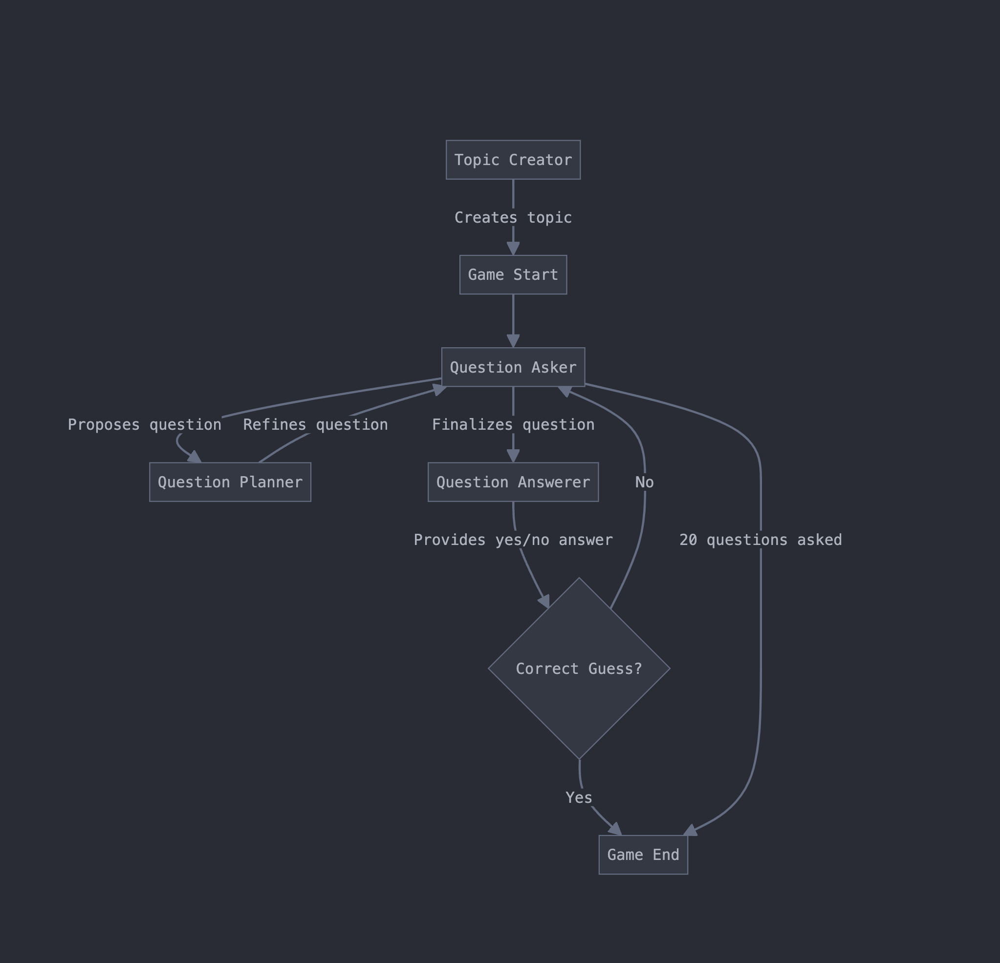

# convergence-tech-task
LLM Agents take-home task for convergence AI

# Running the demo
1. **Compile dependencies** by running `make deps` in the root project directory .
2. **Build Docker image** by running `make build` in the root project directory .
3. **Start containers and enter bash session**  by running `make start` in the root project directory.
4. **Run the game** by running `make app` in the docker container.
5. **Run unit tests** by running `make tests` in the docker container.

### Agentic design

In this solution, we have four agents: a topic creator, a question answerer, a question planner, and a question reviewer. The question answerer's job is comparatively easier than the question planner's, so we do not break it down into a smaller subset of agents. Instead, the question reviewer accompanies the question planner to ensure maximum utility of the questions being asked.

We observe that the game of 20 questions follows a simple and straightforward turn-taking flow, which doesn't require clever decision-making from our agents. Therefore, to ensure reliable interactions between them, we allow them to interact with each other programmatically rather than allowing them to choose their own interactions. Each turn, the question planner confers with the question reviewer multiple times before choosing a question to ask. Metadata captures whether this question is a successful guess that ends the game early.

We use OpenAI and LangChain to create an Agent base class from which all of our agents inherit. Each agent has a memory of their conversations with other agents and can also structure their output into a Pydantic model so that we can reason more easily about their outputs if required.

# Infrastructure

To create a reproducible development environment, we create a Docker container for the application and make it deployable using Docker Compose. We manage the Python dependencies for both development and production by using pip-tools to compile requirements. This allows us to keep our development packages like pytest separate from the packages used in production. For convenience, we add a Makefile to speed up the running of regularly used commands. Important values such as secret keys and other configuration values are stored in a `.env` file, and these values are passed through into the Pydantic BaseSettings class at runtime. Pydantic's BaseSettings class will always read from the environment preferentially over the `.env` file, which allows us to inject environment variables if required.

We add some monitoring through the use of LangFuse and verbose logging statements, which can be exported to a visualization platform such as Grafana. Using LangFuse allows us to view LLM calls as traces, which helps with debugging and prompt engineering.

The LLM calls are optimised by ensuring that they are run asynchronously. We set up a simple but extensible framework that allows us to run multiple simulations of the game concurrently. We use an asynchronous semaphore to restrict the concurrency to avoid being rate-limited by OpenAI. To handle errors we also make use of tenacity in order to retry agent actions when calls to LLMs or output parsing fails.

We add four unit tests, one for each of our agents and we mock the output we might observe from the LLM. These tests aim to catch any small bugs that may result from agent interface changes. Ideally, these unit tests would be run as part of a CI/CD pipeline.

### Evaluation
The task of the question answering agent is relatively simple but still sometimes prone to error. We could investigate incorrect answers by cross-checking the answers to questions in another LLM, either at runtime or afterwards. A rather simple gauge of how well the question planner performs is the number of questions required to guess the game topic. Over a large number of runs I expect this to be a good proxy for the combined quesiton planner and question reviewer team performance.

We could make the task easier or harder by varying the number of questions given to the planner but also by varying the obsecurity of the object or living thing chosen. We could make things easier by allowing the answerer to give hot/warm/cold clues. The number of reviews with the reviewer would be another metric that could be used to track problem difficulty and solution efficiency.

### Future work
The next step for this project would be to allow per-run setting of prompt strings. LangFuse has the ability to catalogue prompts as well as trace LLM calls, so each set of prompt strings could be cached and then provided at runtime to each simulation. The results of the tests, along with the config values used, can be saved for analysis.